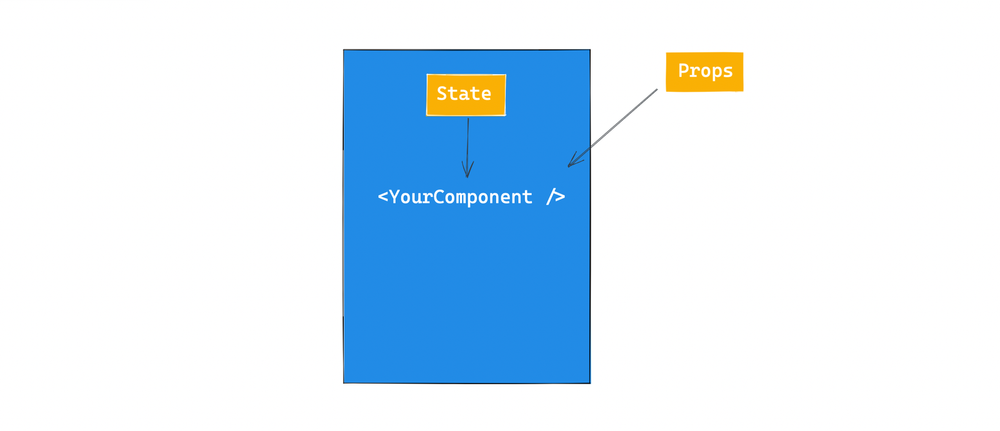

<h1> :books: React Advanced Pattern Notes :books: </h1>

- Polymorphic Components
- Compound Components
- to be updated..

<br>

# :snowflake: Polymorphic Components :snowflake:

- The essential building blocks of reusable components are props and state, where props are external and state is internal



- A polymorphic component is a component that can be rendered with different container element / node.

<br>

### WHy use polymorphic component?

1. Flexibility and accessibility

Example

```
Same <Text /> component but rendered differently on the DOM

<Text component="h1" />
<Text component="h2" />
<Text component="h3" />

```

2. Interoperability

Example

```

import { Link } from "react-router-dom";

<ListItem component={Link}>

```

A polymorphic component NOT only renders element types, but can also render custom components.

<br>

### Key Types to note

1. `React.ElementType`
2. `React.ComponentPropsWithoutRef`
3. For handling `ref`, do not just pass as a prop, the recommended way is to use `forwardRef`

<br>

# :snowflake: Building Polymorphic Components :snowflake:

Basic Implementation

```

const MyComponent = ({ component, children }) => {
    const Component = component || "div";
    return <Component>{children}</Component>
}


// When rendering an element type at runtime, you must first assign it to a capitalised variable, and then render the capitalised variable.

```

With Type Script

```

export const Text = <C extends React.ElementType>({
    component,
    children
}) => {
    const Component = component || "div";
    return <Component>{children}</Component>
}


```
