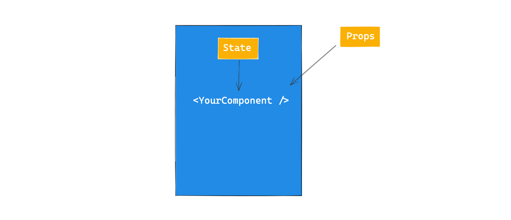

<h1> :books: React Advanced Pattern Notes :books: </h1>

- Polymorphic Components
- Compound Components
- to be updated..

 

# :snowflake: Polymorphic Components :snowflake:

- The essential building blocks of reusable components are props and state, where props are external and state is internal

- A polymorphic component is a component that can be rendered with different container element / node.

### Key Types to note

1. `React.ElementType`
2. `React.ComponentPropsWithoutRef`
3. For handling `ref`, do not just pass as a prop, the recommended way is to use `forwardRef`
